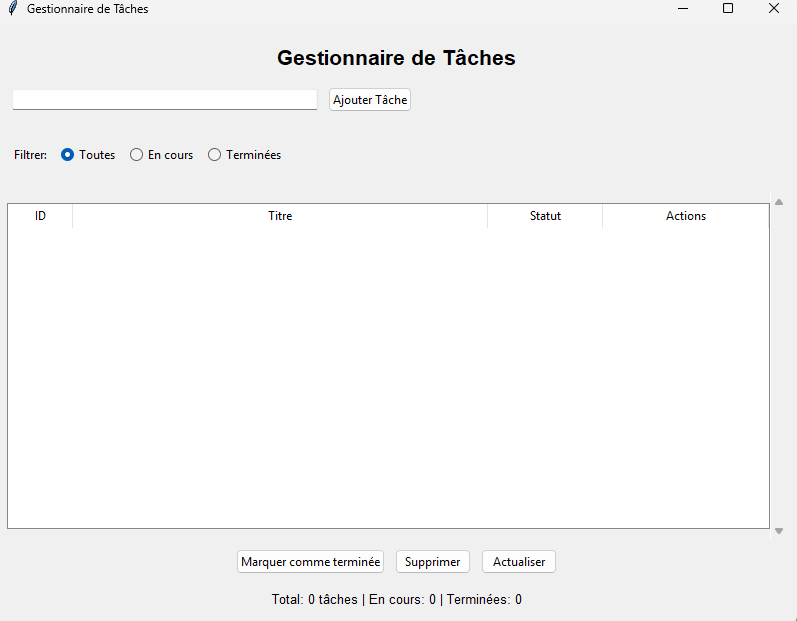

# 📝 Task Manager CLI

Un gestionnaire de tâches en ligne de commande développé en Python.

Ce projet permet de gérer des tâches (ajout, suppression, complétion, affichage) avec persistance des données dans un fichier JSON et système de logging professionnel.

---

## 🚀 Fonctionnalités

- ➕ Ajouter une tâche
- ✅ Marquer une tâche comme complétée
- 📋 Afficher toutes les tâches
- 📌 Afficher les tâches complétées
- ⏳ Afficher les tâches en attente
- ❌ Supprimer une tâche
- 💾 Sauvegarde automatique dans `tasks.json`
- 📄 Logging des actions dans `app.log`

---

## 🧠 Concepts utilisés

- Programmation Orientée Objet (POO)
- Gestion des fichiers JSON
- CRUD (Create, Read, Update, Delete)
- Gestion des exceptions
- Logging professionnel avec `logging`
- Organisation modulaire du code

---

## 📂 Structure du projet

```
GESTION_TACHE/
│

├── main.py

├── task_manager.py

├── app.py

├── tasks.json

└── logs.log
```

---


## ▶️ Utilisation

Lancer le programme :

```bash
python main.py

## interface graphique

```


---

## 📄 Exemple de fichier JSON généré

```json
[
    {
        "id": 1,
        "title": "Learn Python logging",
        "completed": false
    }
]
```

---

## 📈 Améliorations futures

- 🔥 Migration vers argparse (vraie CLI professionnelle)
- 🗃 Utilisation de SQLite
- 🧪 Tests unitaires avec pytest
- 🌐 Version API avec FastAPI
- 🐳 Dockerisation

---


## 📜 Licence

Projet éducatif.